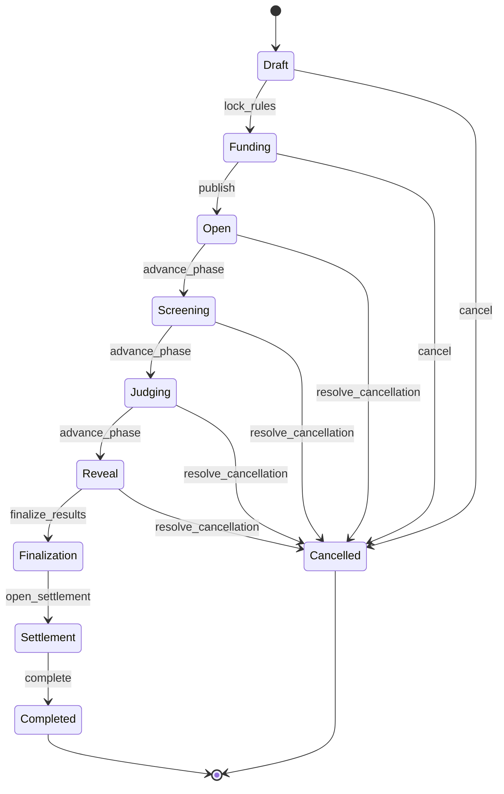
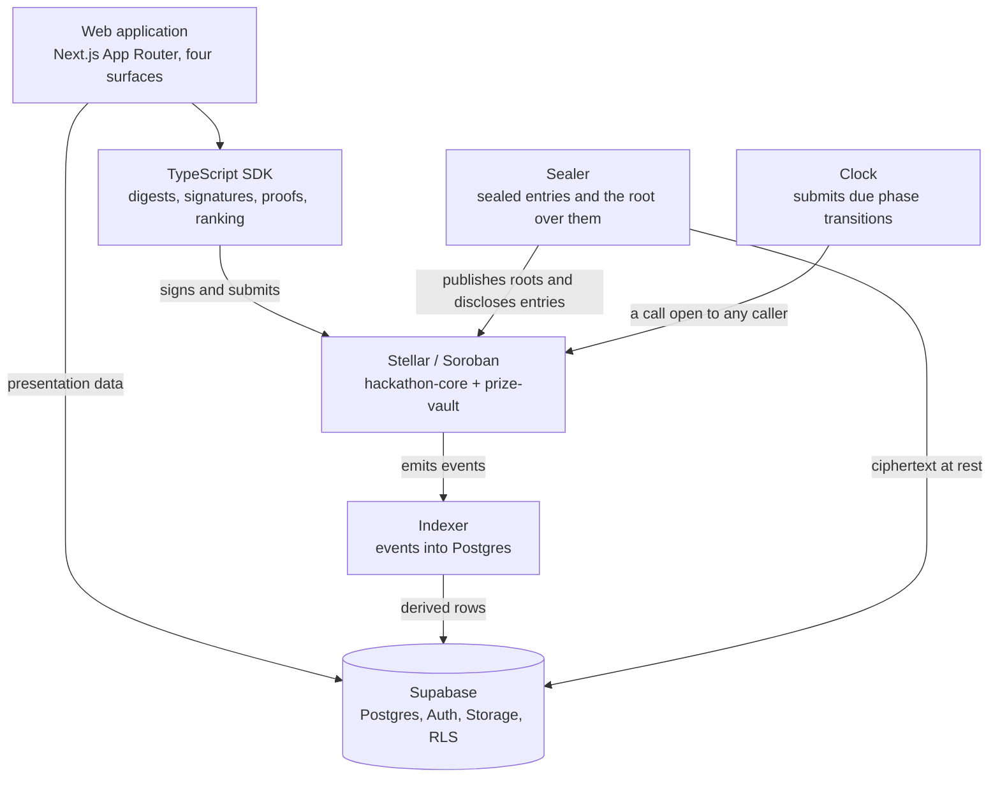
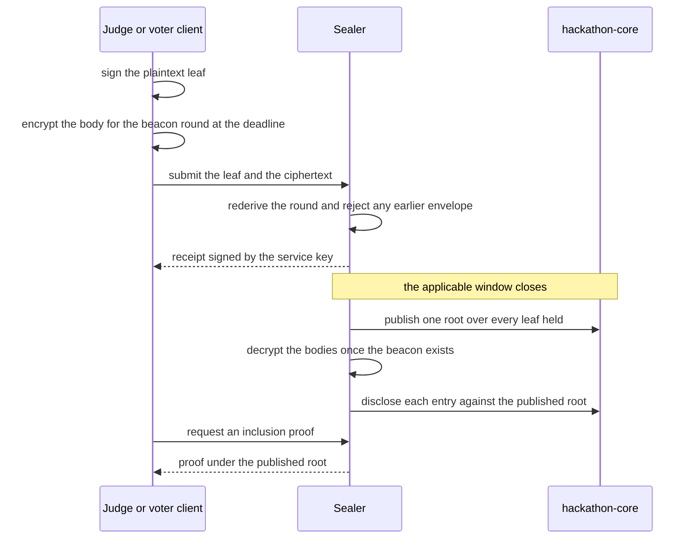
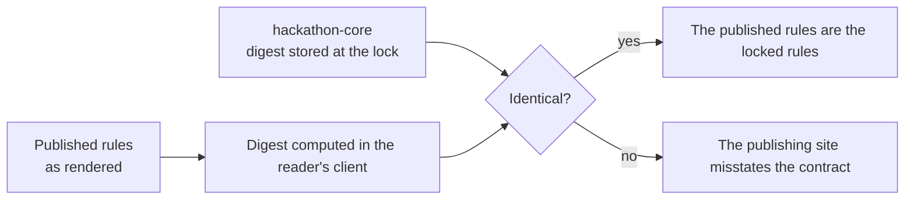

# StelHacks

An end to end verifiable hackathon platform implemented on Stellar and Soroban.

The platform executes the complete lifecycle of a hackathon on chain. An
organizer defines the competition rules, freezes them as a hashed document and
deposits the prize into a smart contract vault. Participants register, form teams
and submit entries. Judges score under seal, and the eligible electorate votes
under seal. When the windows close, the contract derives the ranking from the
frozen formula and the vault disburses the prize to the winning wallets. Each
step produces a permanent public record.

Positioning statement: **No black swans.** The result follows from rules
published in advance, and every exercise of organizer authority is recorded
rather than removed.

## Document summary

| Field | Value |
|:--|:--|
| Target network | Stellar and Soroban |
| Contracts | `hackathon-core` and `prize-vault`, neither upgradeable |
| Layers | Soroban contracts, data and services, web application, shared TypeScript SDK |
| Constitution version | 6 |
| Automated tests | 467 contract, 211 TypeScript, 50 database role |
| Deployment | Both contracts on testnet; no mainnet deployment |
| Requirements document | `StelHacks-PRD.md`, in Turkish |

## Contents

1. [Purpose and scope](#purpose-and-scope)
2. [Lifecycle specification](#lifecycle-specification)
3. [Authority model](#authority-model)
4. [System architecture](#system-architecture)
5. [Contract layer](#contract-layer)
6. [Sealed collection protocol](#sealed-collection-protocol)
7. [Funding and sponsorship](#funding-and-sponsorship)
8. [Discretionary powers](#discretionary-powers)
9. [Settlement and redemption](#settlement-and-redemption)
10. [Verification procedures](#verification-procedures)
11. [Repository structure](#repository-structure)
12. [Build and test procedures](#build-and-test-procedures)
13. [Configuration reference](#configuration-reference)
14. [Test inventory](#test-inventory)
15. [Deployment record](#deployment-record)
16. [Commercial terms](#commercial-terms)
17. [Implementation status](#implementation-status)
18. [Documentation index](#documentation-index)
19. [Licensing](#licensing)

## Purpose and scope

The Stellar ecosystem does not lack hackathons. It lacks a hackathon platform of
its own. Events are currently conducted on general purpose platforms, with the
consequence that an ecosystem may commit substantial prize funding and obtain no
corresponding on chain record: no wallet creation, no transaction history and no
durable evidence of achievement.

The platform addresses eight documented problems.

| Reference | Problem | Affected party |
|:--|:--|:--|
| P1 | The existence of the prize cannot be demonstrated before the event begins | Participant |
| P2 | The method by which a winner was selected is not disclosed | Participant |
| P3 | Disbursement takes weeks, and in some cases does not occur | Participant |
| P4 | Judges observe one another's scores and are influenced by them | Organizer |
| P5 | Community voting is compromised by duplicate accounts | Organizer |
| P6 | Disqualification decisions are contested and their grounds are unrecorded | Both parties |
| P7 | A sponsor cannot demonstrate that funds were distributed as announced | Sponsor |
| P8 | No verifiable record survives the conclusion of the event | Participant, ecosystem |

The design response is stated as a single requirement: a participant must be able
to establish why a given placement was reached without consulting the organizer
and without relying on the correctness of the publishing website.

Four user classes are served from one application: organizer, judge, participant
and observer. The observer class is normative rather than incidental. Any fact
that an authenticated participant can verify must also be verifiable by an
unauthenticated reader, and this constraint governs the design of the
presentation layer.

## Lifecycle specification

A hackathon is one instance of `hackathon-core` bound to one instance of
`prize-vault`. The instance advances through ten phases. Each phase has exactly
one legal successor, so no caller can reach a phase out of order by naming a
target. Clocks rendered in the interface are informational; the contract
enforces every gate itself.



Only three phases end on the clock. The remainder end when the work that closes
them is performed, which is why `advance_phase` refuses any phase without a
closing deadline.

| Transition | Entry point | Condition enforced |
|:--|:--|:--|
| Draft to Funding | `lock_rules`, or `set_up` | Organizer signature; the constitution passes validation and is hashed |
| Funding to Open | `publish`, or `set_up` | Vault balance is not below `required_funding` |
| Open to Screening | `advance_phase` | The submission deadline has passed |
| Screening to Judging | `advance_phase` | The screening deadline has passed |
| Judging to Reveal | `advance_phase` | The judging deadline has passed |
| Reveal to Finalization | `finalize_results` | No disqualification case is unresolved; the ranking is derived and stored |
| Finalization to Settlement | `open_settlement` | The declared safety window has elapsed since finalization |
| Settlement to Completed | `complete` | Every payable position is settled and the platform fee is discharged |
| Any running phase to Cancelled | `cancel`, or `resolve_cancellation` | See [Discretionary powers](#discretionary-powers) |

`advance_phase` requires no authorization and is therefore open to any caller.
The condition it tests is a timestamp any party can read, and the contract
refuses the call before that timestamp irrespective of who submits it. The clock
service exists to submit it, not to decide it.

| Index | Phase | Permitted operations | Prohibited |
|:--|:--|:--|:--|
| 0 | Draft | All configuration | Registration, judging, disbursement |
| 1 | Funding | Deposits, full funding verification | Publication while underfunded |
| 2 | Open | Registration, team formation, submission | Any change affecting the result |
| 3 | Screening | Invalidation, opening a disqualification | Interference with scoring |
| 4 | Judging | Sealed scoring, sealed community voting | Disclosure of any score or tally |
| 5 | Reveal | Simultaneous disclosure of all entries | Modification of any score |
| 6 | Finalization | Derivation of the ranking by the contract | Assignment of a winner by any caller |
| 7 | Settlement | Disbursement to the ranked positions | Interference with the result |
| 8 | Completed | None; the record is permanent | All modification |
| 9 | Cancelled | Execution of the declared cancellation policy | Cancellation outside that policy |

Two phases carry two windows each, because the underlying activities overlap.
Phase `Open` carries the registration window and the submission window. Phase
`Judging` carries the scoring window and the community vote window. Each window
is gated by its own timestamps in addition to the phase.

## Authority model

The governing rule of the system is stated as follows.

> The chain determines outcomes. The database retains presentation data.

| Recorded on the ledger | Recorded in the database |
|:--|:--|
| Constitution digest, phase, organizer, collaborators | Name, description, logo, long form copy |
| Judging bench, assignments, recusals | Judge names, avatars, biographies |
| Prize asset, amounts, vault balance, each payment | Prize copy and receipt formatting |
| Team membership, with shares fixed as equal by rule | Team display names and avatars |
| Submission digest, URI, timestamp, track | Title, description, repository, video, screenshots |
| Sealed roots, disclosed scores, ballots, tallies | Long form written judge feedback |
| Reason digest for each discretionary act | The reason text itself |
| Final ranking and the tie break step applied | Search indexes, leaderboards, analytics |

Two invariants follow, and both are enforced by tests rather than by convention.

1. Every table that mirrors chain state is droppable and reconstructible by
   replaying events from the earliest available ledger. A row that cannot be
   regenerated is not derived data and is not admissible in that layer.
2. No key held by the data layer can move funds or alter a result. The service
   role key is confined to server side components: the indexer, the sealed
   collection service, and the route handlers of the web application. None of
   them holds a Stellar signing key carrying authority in the contracts, and the
   value carries no public prefix, so it cannot reach a browser bundle.

Write access to presentation data is granted on chain evidence rather than on
session state alone. A route handler that records what a hackathon looks like
reads the organizer's address from the contract, requires a signature from that
address, and only then writes with the service key. A session without a
signature identifies an account holder rather than an organizer, and a signature
without a session can be replayed by whoever captured it, so both are required.

The sole service holding a Stellar key is the clock. This is not an exception to
the second invariant: the only call it issues requires no authorization and is
open to any caller, so the address functions as a fee payer rather than as a
permission. Any funded account could submit the identical transaction, and the
contract cannot distinguish between them.

## System architecture

Four layers, each owning its directory, together with three continuously running
services.



| Service | Function | Authority held |
|:--|:--|:--|
| `indexer` | Transforms Soroban events into queryable rows and rebuilds projections from the durable log | None; holds no Stellar key |
| `sealer` | Accepts sealed scorecards and ballots, publishes the committing digest, discloses entries after the deadline | Its own key, named in the constitution |
| `clock` | Submits the transition transaction that a passed deadline requires, since a Soroban contract cannot invoke itself | Fee payment only |

The implementation stack is Rust with the Soroban SDK for the contracts,
TypeScript across all client layers, Next.js on the App Router with React for
the application, Supabase for Postgres, authentication, storage and row level
security, and GitHub Actions for continuous integration including deterministic
contract builds.

## Contract layer

The system comprises two contracts.

`hackathon-core` is the authority. It holds the locked constitution, executes the
lifecycle, records applications, teams, submissions, scorecards and ballots,
derives the ranking and instructs the vault to disburse. It publishes
approximately ninety entry points, including `create`, `lock_rules`, `set_up`,
`publish`, `apply`, `submit_project`, `publish_score_root`, `reveal_score`,
`publish_ballot_root`, `reveal_ballot`, `finalize_results`, `settle_prize`,
`settle_platform_fee` and `complete`.

`prize-vault` holds the funds. It accepts deposits from any address in any phase
and disburses only on instruction from the core instance to which it was bound at
creation. It exposes no administrator and no withdrawal function.

Module organization within the core follows the structure of the problem.

| Module | Responsibility |
|:--|:--|
| `constitution/` | All parameters that determine an outcome, hashed and frozen at the lock |
| `contract.rs` | All entry points |
| `state.rs` | Mutable event state, held separately from the frozen rules |
| `storage.rs` | Typed storage keys and time to live policy; no raw symbol keys |
| `merkle.rs` | Sealed trees for scorecards and ballots, with domain separated leaves |
| `results.rs` | Final scores, the tie break chain and placements |
| `hashing.rs` | All digests, each computed over a domain tagged payload |

Three properties of the contract layer are normative.

**Absence of an upgrade path.** Neither contract exposes an administrator or a
call to `update_current_contract_wasm`. A hackathon whose code could be replaced
after the rules were locked would render the lock ineffective. New code therefore
applies to new events only: each event deploys its own pair of instances, and
instances already on chain continue to execute the code they were deployed with.

**Full precision scoring.** Weighted totals are retained at the maximum weighted
scale rather than reduced to a percentage. Reduction would occur twice, and each
division discards a fraction capable of determining a close result. Rounding is
performed only at the presentation boundary.

**Versioned constitution.** The document is at version 6. A contract compiled
against an earlier version rejects a document it does not recognize, which
prevents a rule set from being reinterpreted after the fact.

The tie break chain is declared in the constitution as an ordered list of rules
rather than fixed in code. Four rule kinds are available: `JudgeScore`, which
compares the mean judge score; `Criterion(id)`, which compares the mean score on
one named criterion; `CommunityScore`, which compares the community weight; and
`SubmissionOrder`, which compares submission time.

Validation rejects a chain that cannot always produce an order. `SubmissionOrder`
must occupy the final position and may appear nowhere else, because every other
rule can come out level a second time and a comparison that stops mid chain has
no defined winner. No rule may be repeated. A named criterion must carry a weight
in every track's rubric. `CommunityScore` is refused where the community vote is
disabled, and an empty chain is refused outright. The step that decided a
placement is recorded as `DecidedBy` and published with the result.

## Sealed collection protocol

Scores and ballots are required to be unreadable until the applicable deadline
and verifiable immediately afterwards. The protocol achieves this without
requiring participants to rely on the discretion of the operator.



**Confidentiality.** The client encrypts each private body for the first Drand
beacon round at or after the judging deadline frozen in the constitution. The
service independently derives that round and rejects any envelope addressed to an
earlier one. Until the beacon exists, the database, the organizer and the service
role process hold ciphertext only. Row level security constitutes an additional
boundary and is not the basis of the confidentiality claim.

**Integrity.** The judge or voter signs the plaintext leaf before encryption, and
the tree commits to that same leaf. A body altered after submission no longer
corresponds to its signature or to its commitment.

**Non repudiation of receipt.** Each intake returns a receipt signed by the
service key, covering the leaf and the time of arrival. The timestamp is inside
the signature and cannot subsequently be moved to assert that an entry was late.

**Detectability of omission.** A verifying receipt for which no inclusion proof
exists under the published root establishes that the entry was dropped. The check
is available to any party, and an adversarial test in the sealer suite exercises
it against a deliberately dishonest service.

**Residual trust assumption.** Availability. The service can refuse an entry or
omit one detectably. It cannot inspect scores before the deadline and therefore
cannot censor selectively on the basis of their contents. The assumption is
documented rather than concealed.

**Community ballot format.** A ballot is an allocation rather than a single mark.
Each eligible wallet is allocated a number of points and distributes them across
a bounded number of projects, spending the full allocation or none of it. The
defaults are ten points across at most three projects, `DEFAULT_VOTE_POWER` and
`DEFAULT_MAX_CHOICES`. Both are set per event in `VotePolicy`, subject to an
upper bound of one thousand points and to the requirement that the allocation is
not smaller than the number of projects it may be spread across, since fewer
points than projects describes a distribution no voter could make. Support for
the voter's own project is permitted.

The bounds reside in the constitution rather than in the interface because they
determine an outcome. An organizer able to raise the allocation during the window
would transfer influence to wallets that had not yet voted, and one able to lower
it would reduce ballots already cast. `validate_ballot` refuses any ballot that
does not correspond to what was frozen.

**Electorate.** The registration deadline fixes the electorate. An application
carries a vote only where it was approved at or before that timestamp, which is
enforced in `may_vote`. Without this an organizer could approve additional
accounts on the morning of the vote and thereby determine the result. Each
disclosed ballot carries its full distribution rather than a total, so support
originating from a project's own members is visible to any party replaying the
log. The rationale for the format, including the decision to permit self support,
is recorded as decision 25 in `docs/decisions.md`.

## Funding and sponsorship

Each hackathon is funded through its own vault. Publication is refused while the
vault holds less than the required amount, which is the full prize table plus the
platform fee where one applies.

At the vault level, `deposit` accepts funds from any address in any phase.
Directed contributions are made through the core, which assigns them to a
position in the prize table. Two entry points serve this purpose.

| Entry point | Effect |
|:--|:--|
| `sponsor_tier` | Increases one named position in one track |
| `sponsor_places` | Divides one contribution across every position in a track, by a split the sponsor selects, in a single signature |

A directed contribution is accepted only when all of the following conditions
hold. They are evaluated in `open_to_sponsors`.

1. The constitution enabled top ups before the lock. An organizer who locked the
   rules with that door closed cannot reopen it once participants have begun
   work.
2. The contribution is not below the announced minimum, `min_bounty`. For
   `sponsor_places` the minimum applies to the contribution as a whole rather
   than to each slice, because the published wall records one line per
   contribution.
3. The recorded sponsorship count is below `MAX_SPONSORSHIPS`, which bounds the
   list that a cancellation must traverse within a single invocation.
4. **The phase is `Open`, `Screening`, `Judging` or `Reveal`**, that is, indexes
   2 through 5: published and not yet ranked.

The two boundaries of that window are deliberate.

The lower boundary is publication. Before publication the pool is measured
against `required_funding`, and a contribution counted toward that measurement
would permit an organizer to publish an event whose prize table their own funds
do not cover. After publication, each deposit increases the pool and the
obligation by the same amount within the same invocation, so the vault covers its
obligations at every instant.

The upper boundary is finalization. A contribution directed at a position whose
winner is already known would be a contribution directed at a named person. The
window therefore closes when the ranking is derived, which is why phases
`Judging` and `Reveal` remain open to sponsors while `Finalization` does not.

The interface applies the identical window. `canSponsor` in
`frontend/lib/sponsor.ts` requires that the rules enabled top ups and that the
phase is between 2 and 5 inclusive, so no control is offered that would open a
wallet prompt destined to be refused. A contribution made after the event has
started is accepted without qualification, and the panel states that the prize
was smaller at the time teams selected their work.

The platform fee is charged in addition to the contribution. The sponsor pays the
contribution plus the fee, and the position increases by the contribution alone,
so the figure displayed on the prize table is the figure that reaches the winner.

Sponsored tracks are supported through `propose_track`, `accept_track`,
`decline_track` and `sponsor_track`. A proposed track inherits its rubric and its
judging bench from the track named in the constitution, and the organizer must
accept it before it exists.

The published wall of contributors is read from the contract rather than from the
platform's own tables, since it names parties who transferred funds into a public
pool and a list assembled by a backend is a list a backend could state
incorrectly.

## Discretionary powers

The platform retains the operational authorities an organizer requires:
application screening, invalidation of an entry, disqualification, prize
increases and the declaration that no submission merited an award. These powers
are not removed. Each one is announced before the lock, bounded by what was
announced, and recorded with a reason digest when exercised.

| Tier | Operation | Conditions |
|:--|:--|:--|
| Unconditionally permitted | Increasing the prize | No party is disadvantaged. The organizer, a sponsor or a third party may contribute within the window defined above, and the increase is published |
| Permitted if announced | Withholding or reducing a track prize on the grounds that no submission qualified | The track was marked before the lock; participants saw the marking before committing work; the judging threshold signs; the grounds are written on chain; the appeal window has elapsed; the destination of the funds was selected in advance |
| Prohibited | Withdrawal or reduction of the prize by the organizer alone after submissions open | Permitting this would invalidate the central claim of the platform |

The same discipline governs the remaining paths.

**Deadline extension.** `extend_deadline` moves the schedule in force while the
announced schedule remains hashed in the constitution, so the difference between
the two is the audit trail. Three limits apply: the move must fit the allowance
published before the lock, a deadline that has already passed cannot be extended,
and the whole schedule is revalidated afterwards, so a submission window pushed
past the screening round is refused. A reason digest is required.

**Disqualification.** Available from screening through the reveal. It requires a
reason digest, grants the affected team an appeal window, and requires the
announced judging threshold to resolve. `finalize_results` refuses to run while
any case remains unresolved, so the ranking waits for the process rather than
preceding it.

**Cancellation.** `cancel` is available to the organizer alone, and only in
`Draft` and `Funding`, where no team has formed and the only funds at risk are
the organizer's own. From the moment submissions open, `open_cancellation`,
`approve_cancellation` and `resolve_cancellation` apply instead, carrying the
threshold announced before the lock, because the party who benefits from stopping
the event cannot be the only party who decides to. Opening a case changes
nothing on its own: the event continues and deadlines continue to pass until the
signatures are recorded. On resolution the pool is returned, with recorded
sponsor contributions repaid first and in full and the remainder going to the
organizer.

**Settlement pause.** Where the constitution selects the safety window mode,
`pause_settlement` and `resume_settlement` are available to the organizer in
`Finalization` and `Settlement`, each requiring a reason digest. The power
suspends disbursement and nothing else. Scores cannot be altered under any of
these paths.

## Settlement and redemption

A team prize is divided equally among members and paid to each wallet directly,
so no member holds another member's share. There are no configurable shares.

`settle_prize` pays one member of one position per invocation. This is a
correctness requirement rather than a convenience: a Stellar account holding no
trustline for the prize asset cannot receive it, and a transfer that fails takes
the entire transaction with it, so a single unprepared member would otherwise
block their teammates. Paid individually, each blocks only themselves. The call
requires no signature, because the ranking is settled, the amounts come from the
frozen prize table, the split is arithmetic and the recipients come from the
team, leaving nothing for any party to decide.

Unclaimed prizes are subject to a claim period and a refund route defined before
the lock, executed through `sweep_unclaimed` and `sweep_share`. The contract does
not mark an event complete until every payable position is settled and the
platform fee is discharged.

Redemption is provided through an anchor integration, since disbursement in a
token is not by itself a usable outcome. A winner may return the asset received
and withdraw local currency through a Stellar anchor, using the `SEP-24` hosted
flow or the `SEP-6` programmatic flow according to what that anchor publishes. No
component of this repository holds funds, receives identity documents or
determines eligibility to withdraw. All endpoints are read from the anchor's own
`stellar.toml`, so redirecting the platform to a different anchor is a change of
one domain value.

## Verification procedures

Four claims are independently verifiable, without an account and without reliance
on this repository.

| Claim | Procedure |
|:--|:--|
| The rules | Hash the published constitution and compare the digest against the value stored by the contract |
| The prize | Read the vault balance from the ledger; the vault is a public account |
| The ranking | Rederive it from the disclosed scorecards and ballots; the SDK performs this from chain data alone |
| Each payment | Each disbursement is a ledger transaction addressed to the receiving wallet |



The reference procedure is the SDK example, which is executed as follows.

```bash
cd sdk
npx tsx examples/verify-result.ts C<contract id> payments
```

The example retrieves the rules and establishes that they are the rules that were
locked, reads every input from which the ranking was derived, rederives the
ranking in the contract's own integer arithmetic and compares the two. A
divergence establishes that the published ranking is not the ranking that the
published data produces.

Three implementation decisions support that procedure.

**Two implementations measured against a written agreement.** The digests that
both languages are required to produce are committed under `fixtures/`, one value
per file. The Rust suite asserts that the contract still produces them, and the
TypeScript suite asserts that the SDK reaches the same values from inputs written
independently in TypeScript. A change on either side fails one of the two suites,
and the fixture identifies which side moved. Encoded bytes are committed
alongside digests: a digest that changed while the bytes did not indicates a
change in hashing, whereas changed bytes indicate a change in the type itself,
which is the condition that silently invalidates every constitution already
locked on chain.

**No hand written encodings.** The SDK does not construct XDR layouts by hand.
Encoding is performed through the contract specification generated from the
compiled wasm, so a field added in Rust is present in TypeScript without a
mirroring step. Event decoding follows the same mechanism, so an event that gains
a field is returned with that field and requires no SDK change.

**Verification is performed on request rather than on load.** The proof component
asserts no more than has been established: an unverified digest is rendered as
unverified rather than as confirmed, since a component that reassures by default
is of negative value. Activating the control loads the Stellar library, queries
the contract over the reader's own connection and reports the response without
traversing platform infrastructure. The logic is separated: `lib/verify.ts`
issues the queries and `lib/verdict.ts` determines what a response permits, with
no network access, because the verdict it reaches constitutes an allegation and
the rules for reaching one must be testable in isolation. Two distinctions are
enforced and both are covered by tests. A refusal returned by the contract is a
response, whereas an absent response is not. A check that could not be performed
leaves a claim unverified rather than verified, so a network outage does not
produce an allegation against an organizer.

Each event additionally publishes a consolidated record at
`/hackathons/[slug]/proof`: the rules and their digest, the funds and their
destinations, the responsible parties, each entry's digest, both sealed roots and
the final ranking, with every value traceable on a block explorer and readable
without authentication.

## Repository structure

```
StelHacks/
├── contracts/          Soroban contracts, Rust workspace
│   ├── hackathon-core/ Authority: rules, lifecycle, ranking, settlement
│   └── prize-vault/    Funds: deposits from any address, disbursement on instruction
├── backend/            Data layer and long lived services
│   ├── supabase/       Schema as ordered migrations, and role tests over HTTP
│   ├── indexer/        Soroban events into Postgres
│   ├── sealer/         Sealed scorecards and ballots, and the root over them
│   └── clock/          Submits due phase transitions
├── frontend/           Next.js App Router application, four surfaces
├── sdk/                TypeScript SDK, shared by the services and the browser
├── fixtures/           Test vectors read by Rust and TypeScript together
├── docs/               Decision log and deployment record
└── StelHacks-PRD.md    Product requirements document, in Turkish
```

`sdk/` and `fixtures/` are located outside the three product layers because they
belong to none of them. The SDK is consumed by both the services and the browser,
so placing it within either would conceal it from the other. The fixtures are
read by the Rust suite and the TypeScript suite simultaneously, which is their
purpose.

Each layer executes its commands from its own directory, so no command depends on
the directory in which it happens to be issued. The Supabase CLI resolves
`supabase/` relative to the working directory and therefore runs from `backend/`.

## Build and test procedures

### Prerequisites

* Rust installed through rustup. The channel, the components and the
  `wasm32v1-none` target are pinned in `contracts/rust-toolchain.toml`, at
  present Rust 1.96.0. The pin exists because a contract holding prize money has
  to be rebuildable byte for byte from a tagged commit years afterwards, so
  raising it is a deliberate change with its own commit.
* Stellar CLI version 27 or later.
* Node.js version 24 or later.
* A Supabase project for the data layer, and a funded testnet account for each
  service that submits transactions.

Note on the environment: the Homebrew `rust` formula shadows rustup and provides
only the host target, which causes every wasm build to fail. If `which cargo`
does not resolve within rustup's shim directory, this is the cause.

### Contracts, from `contracts/`

```bash
cargo test                                # unit and contract tests
cargo fmt --all                           # required before every commit
cargo clippy --all-targets -- -D warnings # continuous integration fails on any warning
stellar contract build                    # wasm artifacts
```

### SDK, from `sdk/`

```bash
npm install
npm test          # digests, merkle, signing, events, ranking, published specification
npm run check     # type checking, including the examples
npm run bindings  # regenerate bindings from the compiled wasm
```

The suite reads the compiled wasm, so `stellar contract build` must have been
executed first. This is intentional: the tests measure the SDK against the
artifact the contracts actually produce, including whether the interface it
publishes can be parsed at all. The contents of `bindings/` are generated and
committed so that consumers do not require the Stellar CLI, are never edited by
hand, and are covered by a test that fails when they cease to match the wasm.

### Data layer and services, from `backend/`

```bash
supabase db push                  # apply migrations to the linked project
supabase migration list           # report applied state
cd supabase/tests && npm test     # role reachability tests
npm run dev                       # indexer, sealer and clock together
```

No local stack is provided. Migrations are applied to the linked project and the
role tests execute against it over HTTP, creating real users and deleting them on
completion.

### Web application, from `frontend/`

```bash
npm install
npm run dev
npm run test    # the verdict rules, which determine what a check may assert
npm run shoot   # capture screenshots in both colour schemes
npm run build
```

The screenshot command is part of the procedure for a documented reason. A
`@theme` block nested within a media query is not conditional in Tailwind v4: it
registers the same tokens unconditionally and the final declaration prevails. An
earlier revision of the design therefore served one palette in both colour
schemes. The defect passed type checking and the build, and was observable only
in a screenshot.

## Configuration reference

One environment file is maintained per side, and each is copied from the
`.env.example` beside it.

| File | Contents |
|:--|:--|
| `backend/.env.local` | Project URL, anonymous key, service role key, network passphrase, RPC endpoint, sealer key, clock key, and the polling interval of each service |
| `frontend/.env.local` | Public values consumed by the browser: project URL and anonymous key, network passphrase, RPC endpoint, sealer URL, anchor domain, enabled sign in providers, platform fee collector address. Server only values consumed by route handlers: the service role key, and the notification key and recipient where organizer applications are announced by email |

The distinction that carries the security requirement is the public prefix rather
than the file boundary. Next.js resolves the environment file adjacent to itself
and exposes to the browser only those values carrying the prefix, so a value
named without it is available to server code and unavailable to a bundle. Values
held by the backend services are not copied into the frontend environment, and no
signing key appears in either file except those the services use to pay fees and
to publish sealed roots.

Two configuration conditions are enforced rather than silently tolerated. Where a
platform fee rate above zero is configured without a collector address, event
creation is refused rather than reduced to a zero rate. Where the notification
key and recipient are absent, organizer applications continue to arrive and are
answered in the administration surface; no party is notified of them.

## Test inventory

| Suite | Command | Count | Coverage |
|:--|:--|:--|:--|
| Contracts | `cargo test` in `contracts/` | 467 | Both Rust crates |
| SDK | `npm test` in `sdk/` | 70 | Digests, merkle proofs, signatures, event decoding, ranking, published specification |
| Services | `npm test` in each of `indexer/`, `sealer/`, `clock/` | 65 | Event ingestion and projection, sealed intake and omission detection, deadline detection |
| Frontend logic | `npm test` in `frontend/` | 76 | Verdict rules, schedule arithmetic, anchor discovery, organizer signature checks, sponsorship windows, image handling, statistics |
| Database roles | `npm test` in `backend/supabase/tests/` | 50 | Role reachability, executed over HTTP against the linked project |

The first four suites were executed against the current tree and pass in full.
The role tests require credentials for the linked project and are therefore run
separately.

The most recent coverage measurement with `cargo llvm-cov` reported above ninety
seven percent of regions and above ninety eight percent of lines across both
crates.

Four suites exist in response to specific classes of defect.

The adversarial contract suite executes without mocked authorization and issues
unsigned calls against the entry points at which a missing signature is most
consequential, from locking the rules to disbursing the vault. Every other test
executes with authorization mocked, with the consequence that before this suite
existed no signature check in the core was exercised, and the suite would have
passed with every authorization statement removed.

The lifecycle suite expresses the phase machine as an invariant rather than as a
sequence, attempting the operations of adjacent phases from each phase in turn.

The conservation tests measure both sides of the fund invariant, establishing
that the vault balance equals deposits less disbursements at all times.

The specification test parses the published interface from outside Rust. The
Soroban contract specification limits an error enumeration to fifty cases. Rust
neither enforces this limit nor warns on it, so exceeding it produces a contract
that executes correctly and an interface that no strict reader outside Rust can
parse, including the official JavaScript SDK. The condition occurred once in this
codebase and is now covered by a test.

Continuous integration executes formatting, linting and the full suites for the
contracts and the SDK, together with a reproducible build check that compiles the
wasm twice from a clean state and compares the resulting hashes.

Scripts under `frontend/scripts/` exercise the live network rather than a test
environment. They generate their own keys and fund them from friendbot, so each
is repeatable from a clean machine. One creates an event and advances it to the
open phase, one executes a complete lifecycle from creation to disbursement with
one minute windows, and one repeats that lifecycle with the scorecard routed
through the collection service, which is the only configuration in which the
service, the SDK and the contract are jointly tested on the definition of a leaf
and the scope of a signature. Defects identified by these scripts are recorded in
`docs/deployments.md`.

## Deployment record

Both contracts are deployed to testnet. Addresses, wasm hashes and upload
transactions are recorded in `docs/deployments.md`. The recorded hashes are those
produced by `stellar contract build` from a clean checkout, and continuous
integration compiles twice and compares, so a matching hash denotes the same
build any reader would obtain. The deployed interface is retrievable from the
network with `stellar contract info interface`.

A reference instance is deployed from that code so that the upload can be
demonstrated in operation. It is open, denominated in testnet lumens, funded
across three positions with the sponsorship window open, and one contribution has
been executed against it.

No mainnet deployment exists. Mainnet is the final milestone and follows a
security review, an internal dry run and a pilot event conducted by an external
organizer.

One recorded constraint affects future contract work. An upload was refused by
the network without identification of the limit exceeded. The wasm had reached
158 KB, of which 93 KB was the published contract specification, because that
specification carries every documentation comment on every entry point, type,
field and error variant; the executable code accounted for 57 KB. The resolution
retained the first paragraph of each documentation block as documentation and
converted the accompanying rationale to ordinary comments, which are not
published. No content was deleted, 192 blocks were converted, and the artifact
returned at 112 KB. Documentation comments on public items are distributed to
every validator and constitute the component of this contract most likely to
exhaust the available size first.

## Commercial terms

Three tiers are offered.

| Tier | Charge | Applicability |
|:--|:--|:--|
| Community | None | Student and community events, approximately under five thousand dollars in prizes. The threshold is an internal guideline applied at organizer approval rather than a contract rule, which excludes exchange rate drift and threshold manipulation from the product |
| Standard | Five percent of the prize, charged in addition to it | An organizer announcing a ten thousand unit prize deposits ten thousand five hundred, and winners receive the full announced amount |
| Annual | A fixed annual fee with no deduction | Organizations conducting several events per year |

The community tier carries one condition. Where the prize amount entered at
creation exceeds the free limit, the standard rate applies as a floor
irrespective of the tier granted, so an estimate supplied during approval cannot
convert a larger event into a free one. A tier already carrying a higher rate
retains it.

Because the prize is held by `prize-vault`, the fee is collected by the contract
itself. The rate is frozen into the constitution at creation, so a subsequent
change to the published rate does not affect an event already locked. An upper
bound of two thousand basis points guards against input error, and a cancellation
returns the fee to the organizer together with the pool.

The contracts and the SDK remain usable without the hosted service.

## Implementation status

The contract layer, the SDK, the data layer and all three services are complete.
A hackathon executes end to end: created, configured, locked, funded, published,
applied to, approved, teamed, entered, screened, judged under seal, voted on
under seal, disclosed, ranked, disbursed and closed, with the vault reaching zero
at closure.

The web application implements all ten specified surfaces across twenty page
routes and eleven route handlers, ten of the latter under `/api`: shell and
identity, organizer setup, the hackathon page, the participant flow, the judge
console, the community vote, the reveal, the transparency record at
`/hackathons/[slug]/proof`, builder profiles and the observer view.

The remaining work is verification rather than construction: an internal dry run
of the reference scenario on testnet, then the cross cutting milestone comprising
a complete Turkish and English interface, an accessibility baseline, performance
budgets, observability and operator documentation, then a pilot event and the
mainnet deployment.

Deferred work is recorded rather than omitted.

| Item | State |
|:--|:--|
| Strict judging mode, in which judges commit and disclose on chain directly | Modelled, validated and hashed; no entry point implemented. The sealed mode is the default, and the strict mode is required only where the availability assumption of the collection service is unacceptable |
| `RefundRoute::Depositors` as a declared route | Refused by validation rather than promised as a route the contract cannot walk. Cancellation is unaffected: recorded sponsor contributions are repaid in full from the sponsorship ledger. What is missing is proportional attribution for undirected deposits |
| A pool exceeding the prize table | Every route out of the vault is tied to a prize position, so an undirected deposit beyond the table remains in the vault at closure. Asserted by `a_surplus_beyond_the_prize_table_has_no_route_out_yet`. Directed contributions are unaffected, since `sponsor_tier` and `sponsor_places` assign them to a position |
| Missing judge fallback | Quorum is enforced by excluding projects below quorum from the ranking; the fallback policy is unwritten |

## Documentation index

| Document | Purpose |
|:--|:--|
| `README.md` | This document: system description and operating procedures |
| `CLAUDE.md` | Working conventions, commands and architecture, loaded automatically by agent tooling |
| `StelHacks-PRD.md` | Product requirements document, in Turkish |
| `docs/decisions.md` | Twenty five entries recording each departure from the requirements document with its rationale. Where the two conflict, this document governs |
| `docs/deployments.md` | Addresses, wasm hashes, the reference instance, and defects identified on the live network |
| Layer documents | `backend/`, `frontend/`, `sdk/` and `fixtures/`, and one per service |

Three codebase conventions are stated here because they explain the structure a
reader will encounter. Test names state the property under defence rather than
the function under call. Comments record rationale rather than mechanics, since
the code already states behaviour. No code is introduced before it has a caller,
so storage accessors, helpers and enumeration variants are added in the same
commit as the code that uses them.

## Licensing

The SDK package declares Apache 2.0. The repository as a whole does not yet carry
a license file. One will be added before public release.
